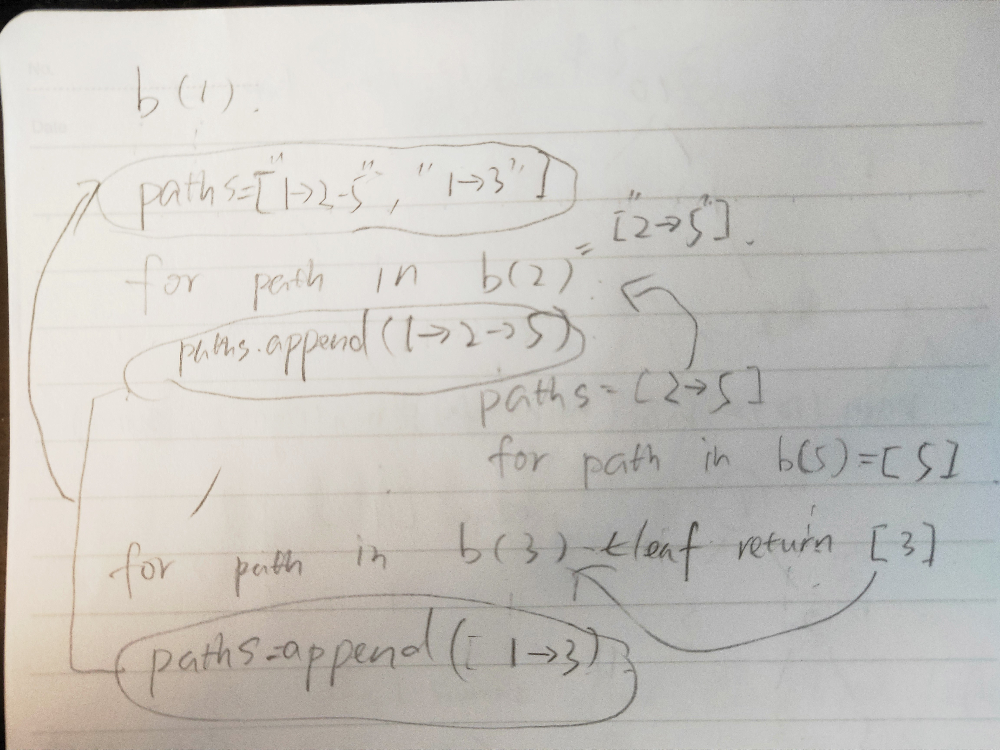

# LintCode Problems

### 415. 有效回文串

[题目描述](https://www.lintcode.com/problem/valid-palindrome/description)

##### 题解 1：

思路：

1. 将string中所有不是数字和字母的char去除。
2. 不断比较字符串第一个和最后一个char，一旦不相等，直接返回False；如果相等，删除首位char，继续比较，直到字符串长度小于等于1，返回True。

```python
class Solution:
    def isPalindrome(self, s):
        # write your code here
        s = ''.join(char for char in s if char.isalnum()).lower()
        while len(s) > 1:
            if s[0] != s[-1]: return False
            else: s = s[1:-1]
        return True
```

##### 题解 2

思路：

1. 同上
2. 使用双指针start和end，分别指向string的首位。当start和end的位置没有重合甚至交叉的时候，比较两个位置的char是否相同，如果否，返回False；如果相同，start右移一格，end左移一格，继续比较。跳出循环后返回True。

```python
class Solution:
    def isPalindrome(self, s):
        # write your code here
        s = ''.join(char for char in s if char.isalnum()).lower()
        start, end = 0, len(s) - 1
        while start < end:
            if s[start] != s[end]: return False
            start += 1
            end -= 1
        return True
```


### 627. 最长回文串

[题目描述](https://www.lintcode.com/problem/longest-palindrome/description)

##### 题解 1

思路：用一个字典记录字符串中每种字符出现的次数。初始化一个变量`ans = 0`用来记录结果。如果字符出现次数大于1且为奇数，ans中加上`次数-1`；如果字符出现次数大于1且为偶数，ans中加上`次数`。如果ans和字符串长度相等，直接返回ans；否则返回ans+1。

```python
class Solution:
	def longestPalindrome(self, s):
        # write your code here
        char_numbers = {}
        for char in s:
            if char not in char_numbers: char_numbers[char] = 1
            else: char_numbers[char] += 1
        ans = 0
        for _, num in char_numbers.items():
            if num > 1 and num % 2 == 0: ans += num
            elif num > 1 and num % 2 != 0: ans += num-1
        return ans + 1 if len(s) > ans else ans
```


### 891. 有效回文 II

[题目描述](https://www.lintcode.com/problem/valid-palindrome-ii/description)

##### 题解思路：

应用双向双指针，逐字符检查。第一次出现left和right指针对应的字符不一样的情况，跳过左边或者右边的一个字符，即执行一次`left += 1`或者`right -= 1`，继续检查。

```python
class Solution:
    def validPalindrome(self, s):
        left, right = self.two_ptr(s, 0, len(s) - 1)
        if left >= right:
            return True
        # left < right --> try to delete 1 character
        return self.is_palindrome(s, left + 1, right) or self.is_palindrome(s, left, right - 1)
        
    def is_palindrome(self, s, left, right):
        left, right = self.two_ptr(s, left, right)
        return left >= right
        
    def two_ptr(self, s, left, right):
        while left < right:
            if s[left] != s[right]:
                return left, right
            left += 1
            right -= 1
        return left, right
```


### 13.字符串查找

[题目描述](https://www.lintcode.com/problem/implement-strstr/description)

##### 题解 1

* 边界条件：如果source==target，直接返回0
* 遍历source，在每个位置比较与target长度相等的子串跟target是否相同，如果是，直接返回当前位置index；如果否，继续遍历，最终返回False。

```python
class Solution:
    def strStr(self, source, target):
        if source == target: return 0
        n_target = len(target)
        for i in range(len(source)):
            if source[i:i+n_target] == target: return i
        return -1
```


##### 题解 2

[九章解法](https://www.jiuzhang.com/solution/implement-strstr/#tag-highlight-lang-python)


### 137. 克隆图

[题目描述](https://www.lintcode.com/problem/clone-graph/description)

```python
"""
Definition for a undirected graph node
class UndirectedGraphNode:
    def __init__(self, x):
        self.label = x
        self.neighbors = []
"""

class Solution:
    """
    @param: node: A undirected graph node
    @return: A undirected graph node
    """
    def cloneGraph(self, node):
        if not node:
            return node
        
        head = node
        nodes = set([node])
        queue = collections.deque([node])
        
        # bfs - get all nodes from node
        while queue:
            node = queue.popleft()
            for neighbor in node.neighbors:
                if neighbor not in nodes:
                    queue.append(neighbor)
                    nodes.add(neighbor)
        
        # node - new node dict 
        node_newnode = {}
        
        # create new nodes based on label values
        for node in nodes:
            node_newnode[node] = UndirectedGraphNode(node.label)
            
        # feed in new neighbors to new nodes
        for node in nodes:
            new_node = node_newnode[node]
            for neighbor in node.neighbors:
                new_node.neighbors.append(node_newnode[neighbor])
                
        return node_newnode[head]
```


### 127. 拓扑排序

[题目描述](https://www.lintcode.com/problem/topological-sorting/description)

```python
"""
Definition for a Directed graph node
class DirectedGraphNode:
    def __init__(self, x):
        self.label = x
        self.neighbors = []
"""


class Solution:
    """
    @param: graph: A list of Directed graph node
    @return: Any topological order for the given graph.
    """
    def topSort(self, graph):
        # calculate in-degree for each node
        indegrees = {node:0 for node in graph}
        for node in graph:
            for neighbor in node.neighbors:
                indegrees[neighbor] += 1
        
        queue = collections.deque([])
        
        for node in graph:
            if indegrees[node] == 0:
                queue.append(node)
        
        ans = []
        
        while queue:
            node = queue.popleft()
            ans.append(node)
            
            for neighbor in node.neighbors:
                indegrees[neighbor] -= 1
                if indegrees[neighbor] == 0:
                    queue.append(neighbor)
                    
        return ans
```


### 7. 二叉树的序列化和反序列化

[题目描述](https://www.lintcode.com/problem/serialize-and-deserialize-binary-tree/description)

!!! 需要反复做

```python
class Solution:

    def serialize(self, root):
        # write your code here
        if root is None:
            return ""
        
        data = []
        queue = collections.deque([root])
        
        while queue:
            node = queue.popleft()
            data.append(str(node.val) if node else '#')
            
            if node:
                queue.append(node.left)
                queue.append(node.right)
        
        return ' '.join(data) 

    def deserialize(self, data):
        # write your code here
        if not data:
            return None
        
        bfs_order = []
        n_nodes = 0
        for nodeval in data.split():
            if nodeval == '#':
                bfs_order.append(None)
            else:
                n_nodes += 1
                bfs_order.append(TreeNode(int(nodeval)))
        
        root = bfs_order[0]
        index = 0
        nodes = [root]
        
        while index < n_nodes:
            nodes[index].left = bfs_order[index*2 + 1]
            nodes[index].right = bfs_order[index*2 + 2]
            
            if nodes[index].left:
                nodes.append(nodes[index].left)
            if nodes[index].right:
                nodes.append(nodes[index].right)
            
            index += 1
                
        return root
```


### 120. 单词接龙

[题目描述](https://www.lintcode.com/problem/word-ladder/description)

```python
class Solution:
    def ladderLength(self, start, end, dict):
        # add end into dict, because as the question stated,
        # start and end are not in dict.
        dict.add(end)
        
        queue = collections.deque([start])
        distance = {start: 1}
        
        while queue:
            cur_word = queue.popleft()
            if cur_word == end:
                return distance[cur_word]
            
            for next_word in self.get_next_word(cur_word, dict):
                if next_word not in distance:
                    distance[next_word] = distance[cur_word] + 1
                    queue.append(next_word)
        return 0
        
    def get_next_word(self, word, dict):
        next_words = []
        for i in range(len(word)):
            left = word[:i]
            right = word[i+1 :]
            for char in 'abcdefghijklmnopqrstuvwxyz':
                if char == word[i]:
                    continue
                if left + char + right in dict:
                    next_words.append(left + char + right)
        return next_words
```


### 66. 二叉树的前序遍历

[题目描述](https://www.lintcode.com/problem/binary-tree-preorder-traversal/description)

```python
class Solution: 
    def preorderTraversal(self, root):
        # write your code here
        
        self.ans = []
        self.traverse(root)
        return self.ans
        
    def traverse(self, root):
        if not root:
            return
        self.ans.append(root.val)
        self.traverse(root.left)
        self.traverse(root.right)
```


### 73. 前序遍历和中序遍历树构造二叉树

[题目描述](https://www.lintcode.com/problem/construct-binary-tree-from-preorder-and-inorder-traversal/description)

思路：

利用前序和中序遍历的特性。preorder的第一个元素一定是树的root。找到这个root在inorder中的位置，那么root左边的元素就是左子树，右边的是右子树。递归一下就可以得到答案。

```python
class Solution:
    def buildTree(self, preorder, inorder):
        if not inorder: return None
        root = TreeNode(preorder[0])
        rootPos = inorder.index(preorder[0])
        root.left = self.buildTree(preorder[1 : 1 + rootPos], inorder[ : rootPos])
        root.right = self.buildTree(preorder[rootPos + 1 : ], inorder[rootPos + 1 : ])
        return root
```


### 97. 二叉树的最大深度

[题目描述](https://www.lintcode.com/problem/maximum-depth-of-binary-tree/description)

##### 思路：

If root is empty, return 0.

Recursively visited left and right child node, return the height that is greater and plus 1 (1 comes from the increased height by the root).

```python
class Solution:
    def maxDepth(self, root):
        if root is None:
            return 0
        return max(self.maxDepth(root.left), self.maxDepth(root.right)) + 1
```


### 93. 平衡二叉树

[题目描述](https://www.lintcode.com/problem/balanced-binary-tree/description)

##### 思路：

Use the idea of [Q97](https://www.lintcode.com/problem/maximum-depth-of-binary-tree/description), calculate the heights of left and right children, if the different is less than or equal to 1, return True; otherwise return False.

```python
class Solution:
    def isBalanced(self, root):
        is_balance, _ = self.validate(root)
        return is_balance
    
    def validate(self, root):
        if not root:
            return True, 0
            
        is_balance, left_height = self.validate(root.left)
        if not is_balance:
            return False, 0
        is_balance, right_height = self.validate(root.right)
        if not is_balance:
            return False, 0
        return abs(left_height - right_height) <= 1,  max(left_height, right_height) + 1
```


### 95. 验证二叉查找树

[题目描述](https://www.lintcode.com/problem/validate-binary-search-tree/description)

##### 题解1：

利用BST的性质：对BST进行in-order traversal，将得到一个sorted array。中序遍历，如果当前节点值大于上一个节点值，则True；否侧False。利用Dummy node，节省代码量。

```python
class Solution:
    """
    @param root: The root of binary tree.
    @return: True if the binary tree is BST, or false
    """
    def isValidBST(self, root):
        # write your code here
        dummy = TreeNode(-sys.maxsize)
        dummy.right = root
        stack = [dummy]
        last = dummy
        
        while stack:
            node = stack.pop()
            if last != dummy and node.val <= last.val:
                return False
            #else:
            last = node
            if node.right:
                root = node.right
                while root:
                    stack.append(root)
                    root = root.left
        return True
```


### 521. 去除重复元素

[题目描述](https://www.lintcode.com/problem/remove-duplicate-numbers-in-array/description)

##### 思路：

先将数组排序。利用两个指针，`i`从位置1开始遍历数组，`ans`从位置1开始，一旦发现下一个数字跟当前数字相同，`ans`保持不动，直到`i`找到一个新的数字，将新数字覆盖到`ans`的位置，`ans`右移一步。

```python
class Solution:
    # @param {int[]} nums an array of integers
    # @return {int} the number of unique integers
    def deduplication(self, nums):
        # Write your code here
        if len(nums) == 0:
            return 0
        nums.sort()
        ans = 1
        for i in range(1, len(nums)):
            if nums[i-1] != nums[i]:
                nums[ans] = nums[i]
                ans += 1
        return ans
```


### 604. 滑动窗口内数的和

[题目描述](https://www.lintcode.com/problem/window-sum/description)

##### 思路：

初始化数组window，把第一个k个数的和放进去，然后从位置1开始遍历，注意遍历结尾位置的定义。每到一个新位置，以前一个和的值为基准，减去出去的数字，加上进来的数字，保存为当前窗口的和，加入window数组。

```python
class Solution:
    def winSum(self, nums, k):
        # write your code here
        if k == 0:
            return nums
        window = [sum(nums[0 : k])]
        for i in range(1, len(nums) - k + 1):
            window.append(window[i-1] - nums[i-1] + nums[i-1+k])
        return window
```


### 228. 链表的中点

[题目描述](https://www.lintcode.com/problem/window-sum/description)

##### 思路：

利用快慢指针。每次，慢一步，快两步。当快到达末尾时，慢刚好是中间点，返回慢指针。

[题目描述](https://www.lintcode.com/problem/middle-of-linked-list/description)

```python
class Solution:
    """
    @param head: the head of linked list.
    @return: a middle node of the linked list
    """
    def middleNode(self, head):
        # write your code here
        if not head:
            return None
        slow = head
        fast = head.next
        while fast and fast.next:
            slow = slow.next
            fast = fast.next.next
        return slow
```


### 585. 山脉序列中的最大值

[题目描述](https://www.lintcode.com/problem/maximum-number-in-mountain-sequence/description)

##### 思路:

- Define two pointers, `start` and `end`.
- While `start`is not to the next of `end`, define `mid`. Compare `mid` with its previous element, if `mid - 1 ` is greater, meaning the peak must be to the left of mid, move `end` to `mid`; otherwise move `start` to `mid`.
- The final state will be that `start` is to the next of `end`, and one of them is the peak. Return the larger one.

```python
class Solution:
    """
    @param nums: a mountain sequence which increase firstly and then decrease
    @return: then mountain top
    """
    def mountainSequence(self, nums):
        # write your code here
        start, end = 0, len(nums) - 1
        
        while start + 1 < end:
            mid = (start + end) // 2
            if nums[mid - 1] > nums[mid]:
                end = mid
            else:
                start = mid
        return max(nums[start], nums[end])
```


### 447. 在大数组中查找

[题目描述](https://www.lintcode.com/problem/search-in-a-big-sorted-array/description)

##### 思路：

利用倍增法的思路，因为现在不知道数组末尾的位置，我们就用一个指针从头开始，每次位置下标增大一倍，直到当前的值大于`target`，就意味着`target`的位置在当前下标位置和上一个下标位置之间。确定了范围之后用二分法查找即可。

```python
"""
Definition of ArrayReader
class ArrayReader(object):
    def get(self, index):
    	# return the number on given index, 
        # return 2147483647 if the index is invalid.
"""
class Solution:
    """
    @param: reader: An instance of ArrayReader.
    @param: target: An integer
    @return: An integer which is the first index of target.
    """
    def searchBigSortedArray(self, reader, target):
        # write your code here
        
        if reader.get(0) == target:
            return 0
        if reader.get(0) > target:
            return -1
        end = 1
        while reader.get(end) < target:
            end *= 2
        start = end // 2
        
        while start + 1 < end:
            mid = (start + end) // 2
            if reader.get(mid) > target:
                end = mid
            if reader.get(mid) < target:
                start = mid
            if reader.get(mid) == target:
                end = mid
        if reader.get(start) == target:
            return start
        if reader.get(end) == target:
            return end
        return -1
```


### 460. Find K Closest Elements

[题目描述](https://www.lintcode.com/problem/find-k-closest-elements/description)

##### 思路：

- Locate the first position called `left` that is greater than the `target` but less than or equal to `target` by the function `get_lower_bound`, which uses binary search.
- Define `right` as the next right position of `left`.
- Use `left` and `right` as two back-to-back pointers who go out in different directions. In each step, get the one that is closer to the target and append its value into the result list, then move the corresponding pointer one step further. We use a function `is_left_closer` to indicate that `left` is closer to the `target` if it returns True, `right` is closer if otherwise. Here is how the function works:
  - If `left`is less than 0, meaning that `left` is out of bound, return False.
  - if `right` exceeds the right bound, meaning that `right` is located at the last position of the given list, then of course `left` is closer no matter what numbers are to the left.
  - If both pointers are in bound, compare the values and return True if `left` is closer, False if otherwise.


```python
class Solution:
    """
    @param A: an integer array
    @param target: An integer
    @param k: An integer
    @return: an integer array
    """
    def kClosestNumbers(self, A, target, k):
        # write your code here
        left = self.get_lower_bound(A, target)
        right = left + 1
        ans = []
        for _ in range(k):
            if self.is_left_closer(A, target, left, right):
                ans.append(A[left])
                left -= 1
            else:
                ans.append(A[right])
                right += 1
        return ans
        
    def get_lower_bound(self, nums, target):
        start, end = 0, len(nums) - 1
        while start + 1 < end:
            mid = (start + end) // 2
            if nums[mid] > target:
                end = mid
            if nums[mid] <= target:
                start = mid
        if self.distance(nums, start, target) <= self.distance(nums, end, target):
            return start
        return end
        
    def distance(self, nums, index, target):
        return abs(nums[index] - target)
        
    def is_left_closer(self, A, target, left, right):
        if left < 0:
            return False
        if right > len(A) - 1:
            return True
        return self.distance(A, left, target) <= self.distance(A, right, target) 
```


### 428. Pow(x, n)

[题目描述](https://www.lintcode.com/problem/powx-n/description)

##### 思路：

First we only consider `n >= 0`. In this case we also need to consider the cases that n is even or odd.

If n is even, `pow(x, n) = pow(x*x, n/2)`. If n is odd, `pow(x, n) = pow(x, n - 1) * x`.

Now we consider the case that `n < 0`. In this case, we first make `n = -n`, asume n is positive and perform the steps described above. Then return `1/result`.

##### Recursion solution:

```python
class Solution:
    """
    @param x {float}: the base number
    @param n {int}: the power number
    @return {float}: the result
    """
    def myPow(self, x, n):
        # write your code here
        if n >= 0:
            return self.helper(x, n)
        if n < 0:
            n = -n
            return 1/self.helper(x, n)
    
    def helper(self, x, n):
        if n == 0: # base case 0
            return 1
        if n == 1: # base case 1
            return x
        if n % 2 == 0:
            return self.helper(x*x, n/2)
        else:
            return self.helper(x, n - 1) * x
```

##### Non-recursion solution:

```python
class Solution:
    """
    @param x {float}: the base number
    @param n {int}: the power number
    @return {float}: the result
    """
    def myPow(self, x, n):
        # write your code here
        if n < 0:
            x = 1/x
            n = - n
            
        ans = 1
        temp = x
        
        while n != 0:
            if n % 2 == 1:
                ans *= temp
            temp *= temp
            n //= 2
        return ans
```


### 159. Find Minimum in Rotated Sorted Array

[题目描述](https://www.lintcode.com/problem/find-minimum-in-rotated-sorted-array/description)

##### 思路：

The original array is sorted, and its rotated version is our input array. If we put the values into an x-y axis graph, say example `4 5 6 7 0 1 2`. It looks like this:

```
			7
		6
	5
4
---------------------------
						2
					1
				0
```

As can be seen from the graph, any value that is greater than `2`, the last number of the array, will be in the upper portion, which is not our interest. Any value that is less than `2` will be closer to our target. Use these two assumptions to keep shorten our searching range, until the `start` and `end` pointers are located next to each other, the smaller one of them is our answer.

```python
class Solution:
    """
    @param nums: a rotated sorted array
    @return: the minimum number in the array
    """
    def findMin(self, nums):
        # write your code here
        start, end = 0, len(nums) - 1
        
        while start + 1 < end:
            mid = (start + end) // 2
            if nums[mid] > nums[end]:
                start = mid
            else:
                end = mid
        return min(nums[start], nums[end])
```


### 140. Fast Power

[题目描述](https://www.lintcode.com/problem/fast-power/description)

##### 思路：

Similar to 428 Pow(x, n), use a faster way to calculate `a^n`, then modules `b`. Note that we can mod `b` in the middle steps to avoid overflow if `a` and `n` are very large numbers.

```python
class Solution:
    """
    @param a: A 32bit integer
    @param b: A 32bit integer
    @param n: A 32bit integer
    @return: An integer
    """
    def fastPower(self, a, b, n):
        # write your code here
        power_a = 1
        
        while n != 0:
            if n % 2 == 1:
                power_a *= a % b
            a *= a % b
            n //= 2
        return power_a % b
```


### 75. Find Peak Element

[题目描述](https://www.lintcode.com/problem/find-peak-element/description)

##### 思路：

- As stated, the second last element is greater than the last one, as a result the last element must not be a peak; and the second element is greater than the first one, i.e. the first element is not a peak as well. Consequently we set `start = 0, end = len(A) - 2`.
- Once we find a position that either side of it is greater, then we say we found a peak. Otherwise we go to the greater side to find. 
- If both sides are greater, we go to any side; note that in this case we cannot shorten the range to `start = mid - 1, end = mid + 1`, since this case indicates that we found a valey, if we shorten the range like that, we shall never find a peak. We can only pick one side.

```python
class Solution:
    """
    @param A: An integers array.
    @return: return any of peek positions.
    """
    def findPeak(self, A):
        # write your code here
        start, end = 1, len(A) - 2
        
        while start + 1 < end:
            mid = (start + end) // 2
            if A[mid] > A[mid + 1] and A[mid] > A[mid - 1]:
                return mid
            if A[mid] < A[mid + 1]:
                start = mid + 1
                continue
            if A[mid] < A[mid - 1]:
                end = mid - 1
                continue
        if A[start] > A[end]:
            return start
        return end
```


### 74. First Bad Version

[题目描述](https://www.lintcode.com/problem/first-bad-version/description)

思路：

Use binary search. 

```python
#class SVNRepo:
#    @classmethod
#    def isBadVersion(cls, id)
#        # Run unit tests to check whether verison `id` is a bad version
#        # return true if unit tests passed else false.
# You can use SVNRepo.isBadVersion(10) to check whether version 10 is a 
# bad version.
class Solution:
    """
    @param n: An integer
    @return: An integer which is the first bad version.
    """
    def findFirstBadVersion(self, n):
        # write your code here
        start, end = 1, n
        while start + 1 < end:
            mid = (start + end) // 2
            if SVNRepo.isBadVersion(mid):
                end = mid
            else:
                start = mid
        if SVNRepo.isBadVersion(start):
            return start
        return end
```


### 62. Search in Rotated Sorted Array

[题目描述](https://www.lintcode.com/problem/first-bad-version/description)

##### 思路1：一次二分查找

If the value at `mid` position is greater than the value at `start` position, do a further comparison: is target in between `start` and `mid`, if yes, move `end` to `mid` position, then all elements within `start` and `end` are in an ascending order, continue the binary search we wil find the answer; if no, move `start` to `mid`. The same idea for the other part.

```python
class Solution:
    """
    @param A: an integer rotated sorted array
    @param target: an integer to be searched
    @return: an integer
    """
    def search(self, A, target):
        # write your code here
        if not A:
            return -1
        start, end = 0, len(A) - 1
        
        while start + 1 < end:
            mid = (start + end) // 2
            if A[mid] > A[start]:
                if A[mid] >= target >= A[start]:
                    end = mid
                else:
                    start = mid
            if A[mid] < A[end]:
                if A[mid] <= target <= A[end]:
                    start = mid
                else:
                    end = mid
            if A[mid] == target:
                return mid
        if A[start] == target:
            return start
        if A[end] == target:
            return end
        return -1
```


##### 思路2：两次二分查找

- First check is this array rotated, if not, call the binary search function and return the value.
- If the array is rotated, use the similar idea of question [159. Find Minimum in Rotated Sorted Array](https://www.lintcode.com/problem/find-minimum-in-rotated-sorted-array/description) to find the peak and valey location. Then perform binary search from the start to peak, and from valey to the end, to search the target.

```python
class Solution:
    """
    @param A: an integer rotated sorted array
    @param target: an integer to be searched
    @return: an integer
    """
    def search(self, A, target):
        # write your code here
        ans = -1
        if not A:
            return ans
        start, end = 0, len(A) - 1
        
        # if the array is rotated 0 step, i.e. no ratation
        if A[start] < A[end]:
            return self.binary_search(A, target, start, end)
        else:
            while start + 1 < end:
                mid = (start + end) // 2
                if A[mid] > A[end]:
                    start = mid
                if A[mid] <= A[end]:
                    end = mid
            peak, valey = start, end
            
            search_left = self.binary_search(A, target, 0, peak)
            search_right = self.binary_search(A, target, valey, len(A) - 1)
            
            if search_left != -1:
                ans = search_left
            if search_right != -1:
                ans = search_right
            return ans
    
    def binary_search(self, A, target, start, end):
        while start + 1 < end:
            mid = (start + end) // 2
            if A[mid] == target:
                return mid
            if A[mid] < target:
                start = mid
            if A[mid] > target:
                end = mid
        if A[start] == target:
            return start
        if A[end] == target:
            return end
        return -1
```


### 900. Closest Binary Search Tree Value

[题目描述](https://www.lintcode.com/problem/closest-binary-search-tree-value/description)

##### 思路1：recursion

Find the lower and upper bound of the target, return the closest one.

How to find a lower bound:

- If `target <= root.val`, it means that the lower bound must be in the left sub-tree, just return `find_lower(root.left, target)`.
- If `target` is greater than root value, it means that current node is a lower bound candidate, we need to check if there is a node whose value is greater than current node value but is still smaller than the `target`, hence we let `lower = find_lower(root.right, target)` to see if there is a node that is closer to the lower bound.
  - If there is one, return it.
  - Otherwise, return current node.

##### 思路2：non-recursive

It uses the similar idea but in a non-recursive way.

```python
"""
Definition of TreeNode:
class TreeNode:
    def __init__(self, val):
        self.val = val
        self.left, self.right = None, None
"""

class Solution:
    """
    @param root: the given BST
    @param target: the given target
    @return: the value in the BST that is closest to the target
    """
    def closestValue(self, root, target):
        # write your code here
        return self.recursion(root, target)
        #return self.non_recur(root, target)
        
    def non_recur(self, root, target):
        upper, lower = root, root
        while root:
            if target > root.val:
                lower = root
                root = root.right
            # use elif, instead of if. Since root might have
            # been changed above
            elif target < root.val: 
                upper = root
                root = root.left
            else:
                return root.val
        if abs(upper.val - target) <= abs(lower.val - target):
            return upper.val
        return lower.val
        
    def recursion(self, root, target):
        lower = self.find_lower(root, target)
        upper = self.find_upper(root, target)
        if not lower:
            return upper.val
        if not upper:
            return lower.val
        if abs(upper.val - target) <= abs(lower.val - target):
            return upper.val
        return lower.val
    
    def find_upper(self, root, target):
        if not root:
            return None
        
        if target >= root.val:
            return self.find_upper(root.right, target)
            
        upper = self.find_upper(root.left, target)
        
        return upper if upper else root
        
    def find_lower(self, root, target):
        if not root: 
            return None
        
        if target <= root.val:
            return self.find_lower(root.left, target)
        
        lower = self.find_lower(root.right, target)
        return lower if lower else root
```


### 596. Minimum Subtree

[题目描述](https://www.lintcode.com/problem/minimum-subtree/description)

##### 思路：

`node_min_sum` is the node with the minimum sum in the entire tree.

`min_sum` is the minimum value of sub-tree sum in the entire tree, i.e. it's the sum of `node_min_sum`.

`tree_sum` is the sum of current node.

The general idea is to compare the `min_sum` values of left sub-tree, right sub-tree and the current node, return the tuple with the mininum sum value.

```python
"""
Definition of TreeNode:
class TreeNode:
    def __init__(self, val):
        self.val = val
        self.left, self.right = None, None
"""

class Solution:
    """
    @param root: the root of binary tree
    @return: the root of the minimum subtree
    """
    def findSubtree(self, root):
        # write your code here
        node_min_sum, min_sum, tree_sum = self.find_min(root)
        return node_min_sum
        
    def find_min(self, root):
        if not root:
            return root, sys.maxsize, 0
            
        left, left_min, left_sum = self.find_min(root.left)
        right, right_min, right_sum = self.find_min(root.right)
        
        tree_sum = left_sum + right_sum + root.val
        
        if left_min == min(tree_sum, left_min, right_min):
            return left, left_min, tree_sum # output tree_sum not left_sum
        if right_min == min(tree_sum, left_min, right_min):
            return right, right_min, tree_sum
        return root, tree_sum, tree_sum
```


### 480. Binary Tree Paths

[题目描述](https://www.lintcode.com/problem/binary-tree-paths/description)

##### 思路1：

`path` is used to store current path, once the dfs traversal reaches a leaf, append this `path` to the `result` list, then pop an element from `path`.

For example:

```pseudocode
   1
 /   \
2     3
 \
  5
dfs(node 1, path = [1], result = []):
	go to left child - node 2 (not leaf):
		path.append(node 2) --> path = [1, 2]
		dfs(node 2, path, result):
            go to right child - node 5 (leaf):
			path.append(node 5) --> path = [1, 2, 5]
			dfs(node 5, path, result):
				result.append(serialized path '1->2->5')
			pop 5 from path --> path = [1, 2]
		pop 2 from path --> path = [1]
	go to right right - node 3 (leaf):
		path.append(node 3) --> path = [1, 3]
		dfs(node 3, path, result):
			result.append(serialized path '1->3')
		pop 3 from path --> path = [1]
result = ['1->2->5', '1->3']
```

```python
class Solution:
    """
    @param root: the root of the binary tree
    @return: all root-to-leaf paths
    """
    def binaryTreePaths(self, root):
        if not root:
            return []
            
        ans = []
        self.dfs(root, [str(root.val)], ans)
        return ans
        
    def dfs(self, root, path, paths):
        if not root.left and not root.right:
            paths.append('->'.join(path))
            
        if root.left:
            path.append(str(root.left.val))
            self.dfs(root.left, path, paths)
            path.pop()
            
        if root.right:
            path.append(str(root.right.val))
            self.dfs(root.right, path, paths)
            path.pop()
```


##### 思路2：

Divide and conquer version DFS.

```python
class Solution:
    """
    @param root: the root of the binary tree
    @return: all root-to-leaf paths
    """
    def binaryTreePaths(self, root):
        if not root:
            return []
            
        if not root.left and not root.right:
            return [str(root.val)] # use []
            
        paths = []
        #if root.left:
        for path in self.binaryTreePaths(root.left):
            paths.append(str(root.val) + '->' + path)
        
        #if root.right:
        for path in self.binaryTreePaths(root.right):
            paths.append(str(root.val) + '->' + path)
        
        return paths
```

Walk through the example above.




### 453. Flatten Binary Tree to Linked List

[题目描述](https://www.lintcode.com/problem/flatten-binary-tree-to-linked-list/description)

##### 思路：

divide: recursively flatten `root.left` and `root.right`, return the last node of `root.left` and last node of `root.right`. Let `root.right` be `left_last`'s right child, let `root`'s left child be its right child, finall reset `root.left` to `None`.

```python
"""
Definition of TreeNode:
class TreeNode:
    def __init__(self, val):
        self.val = val
        self.left, self.right = None, None
"""

class Solution:
    """
    @param root: a TreeNode, the root of the binary tree
    @return: nothing
    """
    def flatten(self, root):
        # write your code here
        if not root:
            return None
        
        left_last = self.flatten(root.left)
        right_last = self.flatten(root.right)
        
        if left_last:
            left_last.right = root.right
            root.right = root.left
            root.left = None
        
        if right_last:
            return right_last
            
        if left_last:
            return left_last
            
        return root
```


### 902. Kth Smallest Element in a BST

[LintCode](https://www.lintcode.com/problem/kth-smallest-element-in-a-bst/description), [LeetCode](https://leetcode.com/problems/kth-smallest-element-in-a-bst/)

##### Solution:

- Create a dummy tree node, whose right child is connected to the given root. The purpose of a dummy node here is to avoid a few lines of duplicate codes.
- Put `dummy` into a stack, then start our loop:
  - Pop a node from the stack, decrese the value of `k` by 1. If `k == 0`, then this node's value is the result.
  - Check if there is a right child of the popped node. If yes, push all it's right child's left descendances into the stack. 

```python
class Solution:
    """
    @param root: the given BST
    @param k: the given k
    @return: the kth smallest element in BST
    """
    def kthSmallest(self, root, k):
        dummy = TreeNode(-1)
        dummy.right = root
        stack = [dummy]
        k += 1
        
        while 1:
            node = stack.pop()
            k -= 1
            if k == 0:
                return node.val
            if node.right:
                root = node.right
                while root:
                    stack.append(root)
                    root = root.left
```


### 88. Lowest Common Ancestor of a Binary Tree

[LintCode](https://www.lintcode.com/problem/lowest-common-ancestor-of-a-binary-tree/description), [LeetCode](https://leetcode.com/problems/lowest-common-ancestor-of-a-binary-tree/)

##### Solution:

Find Lowest Common Ancestor in left and right sub-trees. 

Cases:

- If the root is equal to `A`, `A` if the LCA.
- if `A` and `B` are in different sides, e.g. `A` is in left, `B` is in right, then the root is the LCA.
- If `A` and `B` are in the same sub-tree, find LCA in that sub-tree.

```python
class Solution:
    """
    @param: root: The root of the binary search tree.
    @param: A: A TreeNode in a Binary.
    @param: B: A TreeNode in a Binary.
    @return: Return the least common ancestor(LCA) of the two nodes.
    """
    def lowestCommonAncestor(self, root, A, B):
        # write your code here
        return self.helper(root, A, B)

    def helper(self, root, A, B):
        if not root:
            return None
            
        if root == A or root == B:
            return root
        
        left = self.helper(root.left, A, B)
        right = self.helper(root.right, A, B)
        
        if left and right:
            return root
        if left:
            return left
        if right:
            return right
        return None
```


### 578. Lowest Common Ancestor III

[LintCode](https://www.lintcode.com/problem/lowest-common-ancestor-iii/description)

In addition to previous LCA problem, there is one more condition: A or B may not exist in given tree.

##### Solution:

Add two more variables to the return values: `has_a` and `has_b`.

```python
class Solution:
    """
    @param: root: The root of the binary tree.
    @param: A: A TreeNode
    @param: B: A TreeNode
    @return: Return the LCA of the two nodes.
    """
    def lowestCommonAncestor3(self, root, A, B):
        # write your code here
        a, b, lca = self.helper(root, A, B)
        if a and b:
            return lca
        return None
        
    def helper(self, root, A, B):
        if not root:
            return False, False, None
            
        # left_node is lca if a and b are both in left sub-tree
        # if only a or b in left sub-tree, left_node is a or b
        # if neither, left_node is None
        left_has_a, left_has_b, left_node = self.helper(root.left, A, B)
        right_has_a, right_has_b, right_node = self.helper(root.right, A, B)
        
        a = left_has_a or right_has_a or root == A
        b = left_has_b or right_has_b or root == B
        
        if root == A or root == B:
            return a, b, root
            
        if left_node and right_node:
            return a, b, root
            
        if left_node:
            return a, b, left_node
        
        if right_node:
            return a, b, right_node
        return a, b, None
```


### 495. Implement Stack

[LintCode](https://www.lintcode.com/problem/implement-stack/description)

```python
class Stack:
    """
    @param: x: An integer
    @return: nothing
    """
    def __init__(self):
        self.data = []
        self.size = 0
    
    def push(self, x):
        if self.size == len(self.data) :
            self.data.append(x)
            self.size = len(self.data)
        else:
            self.data[self.size] = x
            self.size += 1
    """
    @return: nothing
    """
    def pop(self):
        if not self.isEmpty():
            self.size -= 1
            return self.data[self.size]
        
    """
    @return: An integer
    """
    def top(self):
        return self.data[self.size - 1]

    """
    @return: True if the stack is empty
    """
    def isEmpty(self):
        return self.size == 0
```

```python
class Stack:
    """
    @param: x: An integer
    @return: nothing
    """
    
    def __init__(self):
        self.stack = []
        
    def push(self, x):
        self.stack.append(x)

    """
    @return: nothing
    """
    def pop(self):
        self.stack.pop()

    """
    @return: An integer
    """
    def top(self):
        return self.stack[-1]

    """
    @return: True if the stack is empty
    """
    def isEmpty(self):
        return len(self.stack) == 0
```


### 494. Implement Stack by Two Queues

[LintCode](https://www.lintcode.com/problem/implement-stack-by-two-queues/description), [LeetCode](https://leetcode.com/problems/implement-stack-using-queues/)

[Approach 1](https://leetcode.com/problems/implement-stack-using-queues/solution/) here is a good illustration.

```python
from collections import deque
class Stack:
    """
    @param: x: An integer
    @return: nothing
    """
    def __init__(self):
        self.q1, self.q2 = deque(), deque()
    
    def push(self, x):
        # write your code here
        self.q1.append(x)

    """
    @return: nothing
    """
    def pop(self):
        # write your code here
        self.switch()
        self.q1, self.q2 = self.q2, self.q1

    """
    @return: An integer
    """
    def top(self):
        # write your code here
        self.switch()
        self.q2.append(self.q1[0])
        self.q1, self.q2 = self.q2, self.q1
        return self.q2.popleft()
        
            
    def switch(self):
        while self.q2:
            self.q2.popleft()
        while len(self.q1) > 1:
            self.q2.append(self.q1.popleft())
        

    """
    @return: True if the stack is empty
    """
    def isEmpty(self):
        # write your code here
        return len(self.q1) == 0
        
```


### 224. Implement Three Stacks by Single Array

[LintCode](https://www.lintcode.com/problem/implement-three-stacks-by-single-array/description)

##### Solution: 

Use index 0, 1, 2 of the array to represent the top elements of three stacks. Use 3 linked list to store elements. The array stores the head node of each linked list.

```python
class Node:
    def __init__(self, value):
        self.val = value
        self.next = None
        #self.prev = None

class ThreeStacks:
    """
    @param: size: An integer
    """
    def __init__(self, size):
        # do intialization if necessary
        self.data = [None] * 3

    """
    @param: stackNum: An integer
    @param: value: An integer
    @return: nothing
    """
    def push(self, stackNum, value):
        # Push value into stackNum stack
        top = Node(value)
        top.next = self.data[stackNum]
        #top.next.prev = top
        self.data[stackNum] = top

    """
    @param: stackNum: An integer
    @return: the top element
    """
    def pop(self, stackNum):
        # Pop and return the top element from stackNum stack
        popped = self.data[stackNum]
        self.data[stackNum] = popped.next
        return popped.val

    """
    @param: stackNum: An integer
    @return: the top element
    """
    def peek(self, stackNum):
        # Return the top element
        return self.data[stackNum].val

    """
    @param: stackNum: An integer
    @return: true if the stack is empty else false
    """
    def isEmpty(self, stackNum):
        # write your code here
        return self.data[stackNum] == None
```


### 40. Implement Queue by Two Stacks

[LintCode](https://www.lintcode.com/problem/implement-queue-by-two-stacks/description), [LeetCode](https://leetcode.com/problems/implement-queue-using-stacks/)

##### Solution:

push: always push to stack `s1`.

pop: if `s2` is not empty, it means that the elements in `s1` has been moved to `s2`, and the `first-in` element is now at the `last-out` position in `s2`. Pop `s2` directly. 

top: same idea of pop, but return the last element in `s2`, instead of pop it.

```python
class MyQueue:
    
    def __init__(self):
        # do intialization if necessary
        self.s1, self.s2 = [], []

    """
    @param: element: An integer
    @return: nothing
    """
    def push(self, element):
        # write your code here
        self.s1.append(element)

    """
    @return: An integer
    """
    def pop(self):
        # write your code here
        if not self.s2:
            self.move_elements()
        return self.s2.pop()
        
    """
    @return: An integer
    """
    def top(self):
        # write your code here
        if not self.s2:
            self.move_elements()
        return self.s2[-1]

    def move_elements(self):
        while self.s1:
            self.s2.append(self.s1.pop())
            
    def switch(self):
        self.s1, self.s2 = self.s2, self.s1
```


### 955. Implement Queue by Circular Array

[LintCode](https://www.lintcode.com/problem/implement-queue-by-circular-array/description), [LeetCode](https://leetcode.com/problems/design-circular-queue/)

##### Solution:

Use `head` and `tail` to indicate the queue's front and end positions, respectively.

```python
class MyCircularQueue:

    def __init__(self, k: int):
        """
        Initialize your data structure here. Set the size of the queue to be k.
        """
        self.data = [0] * k
        self.size = 0
        self.head = 0
        self.tail = 0
        self.n = k
        

    def enQueue(self, value: int) -> bool:
        """
        Insert an element into the circular queue. Return true if the operation is successful.
        """
        if self.isFull(): 
            return False
        self.data[self.tail] = value
        self.tail = (self.tail + 1) % self.n
        self.size += 1
        return True

    def deQueue(self) -> bool:
        """
        Delete an element from the circular queue. Return true if the operation is successful.
        """
        if self.isEmpty():
            return False
        self.head = (self.head + 1) % self.n
        self.size -= 1
        return True

    def Front(self) -> int:
        """
        Get the front item from the queue.
        """
        if self.isEmpty():
            return -1
        return self.data[self.head]
        

    def Rear(self) -> int:
        """
        Get the last item from the queue.
        """
        if self.isEmpty():
            return -1
        return self.data[self.tail - 1]
        

    def isEmpty(self) -> bool:
        """
        Checks whether the circular queue is empty or not.
        """
        return self.size == 0
        

    def isFull(self) -> bool:
        """
        Checks whether the circular queue is full or not.
        """
        return self.size == self.n
        


# Your MyCircularQueue object will be instantiated and called as such:
# obj = MyCircularQueue(k)
# param_1 = obj.enQueue(value)
# param_2 = obj.deQueue()
# param_3 = obj.Front()
# param_4 = obj.Rear()
# param_5 = obj.isEmpty()
# param_6 = obj.isFull()
```


### 128. Hash Function

[LintCode](https://www.lintcode.com/problem/hash-function/description)

##### Solution:

取模过程要使用同余定理：
(a * b ) % MOD = ((a % MOD) * (b % MOD)) % MOD

```python
class Solution:
    """
    @param key: A string you should hash
    @param HASH_SIZE: An integer
    @return: An integer
    """
    def hashCode(self, key, HASH_SIZE):
        ans = 0
        for char in key:
            ans = (ans*33 + ord(char)) % HASH_SIZE
        return ans
```


### 130. Heapify

[LintCode](https://www.lintcode.com/problem/heapify/description)

##### Solution:

- Perform `shiftdown` on all the father nodes (i.e. nodes with at least 1 child), from the last father node to the root.
- `shiftdown`:
  - Find the child (called `son`) with the minimum value between children.
  - If `son` is already greater than `father`, the tree rooted at `father` is already a heap.
  - If `son` is smaller than `father`, swap `son` and `father` and keep `shiftdown` until all nodes meet requirements.

```python
class Solution:
    """
    @param: A: Given an integer array
    @return: nothing
    """
    def heapify(self, A):
        # write your code here
        for i in reversed(range(len(A) // 2 )):
            self.shiftdown(A, i)
            
    def shiftdown(self, A, father):
        while father * 2 + 1 < len(A):
            son = father * 2 + 1
            if son + 1 < len(A) and A[son] > A[son + 1]:
                son += 1
            if A[son] > A[father]:
                break
            
            A[father], A[son] = A[son], A[father]
            father = son
```

